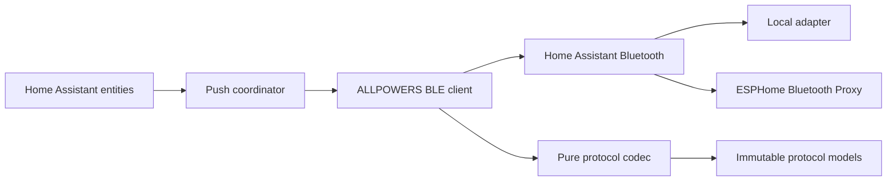

# ALLPOWERS BLE for Home Assistant

[](https://www.home-assistant.io/)
[](https://www.hacs.xyz/)
[](https://github.com/dedalodaelus/home-assistant-allpowers-ble/actions/workflows/ci.yml)
[](docs/quality.md)
[](LICENSE)

[Español](README.es.md)

A local Home Assistant custom integration for compatible ALLPOWERS portable power
stations. It connects through Home Assistant's Bluetooth stack, so the same
integration works with a local Bluetooth adapter or a connectable ESPHome
Bluetooth Proxy.

There is no vendor cloud, no direct BlueZ access, and no ESPHome component is
required on the power station side.

> [!IMPORTANT]
> The **ALLPOWERS R600** is the verified target. Similar names do not prove
> protocol compatibility. Every device is actively checked for the expected GATT
> service, characteristics, and a checksum-valid status frame before setup.

## Highlights

- Automatic Bluetooth discovery and UI-only configuration.
- Local operation through Home Assistant Bluetooth and ESPHome Bluetooth Proxy.
- Multiple power stations, one config entry and BLE connection manager per device.
- Battery, power, remaining-time, output, settings, version, RSSI, and health entities.
- Safe write gating from fresh snapshots; settings writes preserve unknown bits and output writes preserve verified output states.
- Reconnection with a fresh Home Assistant-selected adapter/proxy route.
- Incremental parser for fragmented, concatenated, and noisy BLE notifications.
- Config-entry and device diagnostics with address redaction.
- English and Spanish translations.
- HACS release ZIP, semantic versioning, automated releases, tests, coverage,
  Ruff, Mypy, Pylint, Hassfest, HACS validation, CodeQL, and Dependabot.

## Compatibility

| Model / advertisement | Status | Notes |
|---|---:|---|
| ALLPOWERS R600 (`R600*`, `AP R*`) with verified revision signature (`hardware_version=1.2`, `raw_hardware_version=0x12`) | Verified | Primary development and protocol target with writable controls enabled. |
| AP S300 and similar `AP S*` units | Experimental read-only | Accepted only after an active GATT and protocol probe. Telemetry entities are exposed, but writable controls remain disabled. |
| AP S500 / AP S700 V2 family | Rejected | Known to use a different protocol revision. |
| Generic `ALLPOWERS*` or FFF0 advertisement | Experimental read-only | Setup proceeds only after protocol validation. Telemetry is exposed, but writable controls remain disabled. |

See [Compatibility](docs/compatibility.md) before reporting another model as
supported.

## Requirements

- Home Assistant **2026.7.0 or newer**.
- HACS for the recommended installation method.
- A connectable Bluetooth route:
  - a Bluetooth adapter available to Home Assistant, or
  - an ESPHome Bluetooth Proxy with active connections enabled.
- The ALLPOWERS device powered on and within reliable BLE range.

A passive-only proxy can advertise a device but cannot maintain the GATT connection
required by this integration.

## Installation

### HACS custom repository

1. Open **HACS** in Home Assistant.
2. Open the menu and select **Custom repositories**.
3. Add `https://github.com/dedalodaelus/home-assistant-allpowers-ble` as an
   **Integration** repository.
4. Install **ALLPOWERS BLE**.
5. Restart Home Assistant.
6. Open **Settings → Devices & services**. Accept the discovered device, or select
   **Add integration → ALLPOWERS BLE**.

### Manual installation

Copy the integration directory into the Home Assistant configuration directory:

```text
custom_components/allpowers_ble/
```

Restart Home Assistant, then add **ALLPOWERS BLE** from **Devices & services**.
Do not copy the whole source repository into `custom_components`.

## Bluetooth Proxy

A typical ESPHome proxy configuration is:

```yaml
esp32_ble_tracker:

bluetooth_proxy:
  active: true
```

Home Assistant chooses the best currently available connectable route. The
integration resolves that route again before each reconnection rather than pinning
it permanently to one proxy.

## BLE trust boundary

This integration assumes a trusted local Home Assistant environment:

- write commands are accepted only from Home Assistant users who can control entities;
- BLE proximity limits command reach, but nearby radio access is still part of the risk model;
- ESPHome proxies are transport relays and must be managed like trusted local infrastructure;
- there is no cloud credential boundary to rotate if local access is compromised.

Do not treat this integration as a hard safety interlock for unattended critical loads.

## Entities

Entities become unavailable when the underlying data is stale. This prevents a
connected-but-silent BLE session from presenting old values as current or using
old state to construct a write.

| Platform | Entities |
|---|---|
| Sensor | Battery, input power, output power, remaining time, RSSI, hardware version, firmware version, reconnects, protocol errors, watchdog resets |
| Binary sensor | Connected, telemetry available, settings available, input active, output active, AC output, DC output, light output |
| Switch | AC output, DC output, light, ECO mode, experimental car charger |
| Select | Work mode, ECO shutdown time |
| Button | Refresh status, reconnect, send settings keepalive |
| Number | Status request interval, settings keepalive interval |

Diagnostic and advanced tuning entities are disabled by default where appropriate.
The car-charger control is unavailable until it is explicitly enabled in the
integration options. Experimental profiles are telemetry-only and do not create
write entities.
Diagnostic counters are session-scoped values and intentionally do not expose a
long-term statistics state class.

## Safety model

The vendor protocol combines several controls into single bit fields. Sending only
the bit that changed can unintentionally alter another output. This integration
therefore applies the following invariants:

1. AC, DC, and light changes require a fresh status snapshot and emit one combined
   command preserving the other output states.
   Preservation is guaranteed for documented output states only; undocumented
   output-command semantics are not claimed safe.
2. ECO, work mode, car charger, and ECO timeout changes require a fresh settings
   snapshot and preserve every unrelated raw flag bit.
3. Each write starts a versioned command transaction and waits for a matching
   on-device confirmation before the next write can reuse that state.
4. Pending transactions and freshness are invalidated on every disconnect and
   new GATT session.
5. The BLE client enforces revision-aware write capabilities at the transport
   boundary for output, settings, and settings keepalive commands.
6. Writes are rejected rather than guessed when the required snapshot is missing,
   stale, disconnected, or unauthorized for the active profile.

Any future write-safety guarantee must be supported by captured evidence from the
target hardware revision and a matching regression test.

See [Architecture](docs/architecture/README.md) and [Protocol](docs/protocol.md).

## Conservative automation examples

Use automations that fail safe when telemetry is stale or unavailable, and avoid
autonomous control of critical loads.

Example 1: notify when telemetry drops instead of forcing output writes.

```yaml
automation:
   - alias: allpowers_telemetry_unavailable
      triggers:
         - trigger: state
            entity_id: binary_sensor.allpowers_telemetry_available
            to: "off"
            for: "00:01:00"
      actions:
         - action: persistent_notification.create
            data:
               title: ALLPOWERS telemetry unavailable
               message: Check BLE route, proxy availability, and station power state.
```

Example 2: gate a non-critical AC enable action behind explicit conditions.

```yaml
automation:
   - alias: allpowers_enable_ac_non_critical
      triggers:
         - trigger: state
            entity_id: binary_sensor.allpowers_connected
            to: "on"
      conditions:
         - condition: state
            entity_id: binary_sensor.allpowers_telemetry_available
            state: "on"
         - condition: numeric_state
            entity_id: sensor.allpowers_battery
            above: 40
      actions:
         - action: switch.turn_on
            target:
               entity_id: switch.allpowers_ac_output
```

Always test automations manually with non-critical loads before enabling them.

## Removal and recovery

To remove the integration cleanly:

1. Disable or remove automations that reference ALLPOWERS entities.
2. Remove the ALLPOWERS BLE config entry from Home Assistant Devices and services.
3. If installed with HACS, uninstall ALLPOWERS BLE in HACS and restart Home Assistant.
4. If installed manually, delete `custom_components/allpowers_ble` and restart.
5. Confirm that entity and device records are gone; remove orphaned helpers if present.

If you plan to reinstall, keep a sanitized diagnostics export before removal so
route and model-detection history can be compared after recovery.

## Communication contract and IoT class

The manifest declares `iot_class: local_polling` because normal operation depends
on periodic local status requests while still consuming push notifications.

- Polling path: the client sends a status-request frame every configured
   `status_interval`.
- Push path: status and settings notifications can arrive at any time and update
   entity state without waiting for the next request.
- Recovery path: watchdog and reconnect traffic exists only to recover transport
   health, not to increase normal polling cadence.

The rationale and evidence baseline for this classification is tracked in issue
#55 and architecture decision 0003.

Every periodic operation has an explicit trigger and lower bound:

| Periodic operation | Trigger | Default | Lower bound |
|---|---|---:|---:|
| Status request | Connected session and no request in interval | 20 s | 10 s |
| Settings keepalive (optional) | Enabled and no keepalive in interval (plus one initial send after fresh settings) | 540 s | 60 s |
| Reconnect backoff retry | Connection failure or disconnect | 1 s initial, capped at 60 s | 0 s jitter floor, 5 s configurable cap minimum |
| Telemetry watchdog reconnect | No fresh status telemetry in watchdog window | 45 s | Must be greater than stale timeout |
| Transport watchdog reconnect | No BLE packet in watchdog window | 45 s | Must be greater than stale timeout |

Aggressive intervals can overload local adapters or Bluetooth Proxy connection
capacity, especially with multiple devices. Keep defaults unless you have a
measured reason to tune them.

## Runtime options

Defaults are deliberately conservative and match observed R600 behavior.

| Option | Default | Valid range / behavior |
|---|---:|---|
| Status request interval | 20 s | 10–120 s |
| Telemetry stale timeout | 30 s | Must exceed the status interval |
| Telemetry and transport watchdog timeout | 45 s | Must exceed the stale timeout |
| Maximum reconnect delay | 60 s | 5–300 s |
| Settings stale timeout | 600 s | 60–3600 s |
| Settings keepalive | Off | Experimental; disabled unless explicitly enabled |
| Settings keepalive interval | 540 s | 60–540 s; settings timeout must be longer |
| Car charger control | Off | Experimental; exposes no writable control until enabled |

Options are applied live. A full integration reload is not required.

## Diagnostics and logging

Download diagnostics from the integration or device page in Home Assistant. The
payload includes:

- connection attempts, successful connections, disconnects, and reconnects;
- notification, valid-packet, parser-discard, protocol-error, write-error, and watchdog counters
   (total, telemetry, and transport);
- last connection, disconnection, packet, and error information;
- current cached protocol state and freshness metadata;
- active options and model-support classification.

Bluetooth identifiers are redacted recursively across structured fields and
nested strings. Device-provided names and user entry names are replaced with a
stable redaction marker in diagnostics payloads. The `last_error` field keeps an
error category with sanitized detail and is reported in diagnostics payloads.
No cloud credentials exist.

For temporary debug logging:

```yaml
logger:
  logs:
    custom_components.allpowers_ble: debug
    bleak_retry_connector: debug
```

Remove verbose logging after collecting the relevant failure because Bluetooth
logs can be large. See [Troubleshooting](docs/troubleshooting.md).

## Architecture



The protocol package imports no Home Assistant module. It can be tested and reused
independently from transport and entity code.

## Development

Python 3.14.2 or newer is required by the targeted Home Assistant release.

```bash
python3.14 -m venv .venv
source .venv/bin/activate
python -m pip install --upgrade pip
python -m pip install -r requirements_test.txt
pre-commit install
make all
```

Build the HACS release asset with:

```bash
python scripts/build_release.py --clean
```

The generated `dist/allpowers_ble.zip` contains `manifest.json`, `__init__.py`, and
the rest of the integration at the archive root. This is the layout expected by
HACS when `zip_release` is enabled.

More information:

- [Development guide](docs/development.md)
- [Adding models](docs/adding-models.md)
- [Quality and test strategy](docs/quality.md)
- [Contributing](CONTRIBUTING.md)
- [Security policy](SECURITY.md)

## Support and reporting

- Report bugs and model compatibility through the public issue forms:
   [GitHub Issues](https://github.com/dedalodaelus/home-assistant-allpowers-ble/issues/new/choose)
- Report vulnerabilities privately through
   [GitHub Security Advisories](https://github.com/dedalodaelus/home-assistant-allpowers-ble/security/advisories/new)

## Project status

This is a community custom integration. It follows current Home Assistant patterns
and quality-scale practices, but it is not part of Home Assistant Core and has not
been reviewed or supported by the Home Assistant project.

Releases are promoted through reviewed pull requests from `devel` to `main` with
CI validation, repository validation, and safety-documentation updates before
publication. Urgent production fixes may target `main` only from `hotfix/*`
branches cut from `main`, and then must be propagated back to `devel`.
Quality goals describe current evidence and tests, not a formal Home Assistant
certification program.

Direct commits into `devel` and `main` are not permitted. Pull requests into `main` are only allowed from `devel` or from `hotfix/*` branches cut from `main`.

## License

MIT. See [LICENSE](LICENSE).
