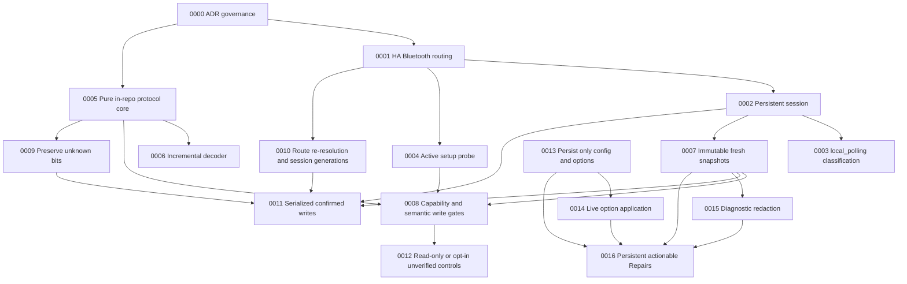

# Architecture decision log

## Purpose

This directory records architecturally significant decisions for the ALLPOWERS
BLE integration. Each accepted record is intended to describe one decision, its
context, alternatives, consequences, evidence, and conditions that should cause a
review.

All initial records are retrospective reconstructions of behavior already present
on `main` when reviewed on 2026-07-26. `Recorded` is therefore not the original
decision date.

## Index

| ADR | Status | Recorded | Decision |
|---|---|---:|---|
| [0000](0000-record-architecture-decisions.md) | Accepted | 2026-07-26 | Record architecturally significant decisions in version-controlled Markdown. |
| [0001](0001-route-all-ble-access-through-home-assistant.md) | Accepted | 2026-07-26 | Route all BLE access through Home Assistant. |
| [0002](0002-maintain-one-persistent-session-per-config-entry.md) | Accepted | 2026-07-26 | Maintain one persistent GATT session per config entry. |
| [0003](0003-classify-the-integration-as-local-polling.md) | Accepted | 2026-07-26 | Classify the integration as local polling. |
| [0004](0004-require-an-active-protocol-probe-before-setup.md) | Accepted | 2026-07-26 | Require an active GATT and protocol probe before setup. |
| [0005](0005-keep-the-protocol-core-in-repository-and-home-assistant-independent.md) | Accepted | 2026-07-26 | Keep the protocol core in the repository and independent from Home Assistant. |
| [0006](0006-decode-notifications-with-a-bounded-incremental-stream-parser.md) | Accepted | 2026-07-26 | Decode notifications with a bounded incremental stream parser. |
| [0007](0007-publish-immutable-snapshots-and-gate-operations-by-freshness.md) | Accepted | 2026-07-26 | Publish immutable snapshots and gate operations by freshness. |
| [0008](0008-authorize-writes-with-verified-capabilities-and-semantic-state.md) | Accepted | 2026-07-26 | Authorize writes with verified capability profiles and semantic state. |
| [0009](0009-preserve-unrelated-and-unknown-protocol-bits.md) | Accepted | 2026-07-26 | Preserve unrelated and unknown protocol bits. |
| [0010](0010-re-resolve-routes-and-isolate-session-generations.md) | Accepted | 2026-07-26 | Re-resolve BLE routes and isolate GATT session generations. |
| [0011](0011-serialize-writes-and-require-device-confirmation.md) | Accepted | 2026-07-26 | Serialize writes and require device confirmation. |
| [0012](0012-keep-unverified-controls-read-only-or-opt-in.md) | Accepted | 2026-07-26 | Keep unverified controls read-only or explicitly opt-in. |
| [0013](0013-persist-only-configuration-and-validated-options.md) | Accepted | 2026-07-26 | Persist only configuration and validated options. |
| [0014](0014-apply-runtime-options-without-reloading-the-entry.md) | Accepted | 2026-07-26 | Apply runtime options without reloading the config entry. |
| [0015](0015-redact-device-identifiers-from-diagnostics.md) | Accepted | 2026-07-26 | Redact device identifiers from exported diagnostics. |
| [0016](0016-emit-persistent-repairs-only-for-actionable-failures.md) | Accepted | 2026-07-28 | Emit persistent Repairs only for actionable failures. |

## Relationship map

## Governance

- Use [the template](template.md) for new decisions.
- One ADR records one architecturally significant decision.
- Accepted records are append-only except for status and clearly dated notes.
- A replacement decision must create a new ADR and link both directions with
  `Supersedes` and `Superseded by`.
- Evidence should point to implementation, tests, protocol captures, or published
  project documentation. Do not claim hardware safety from code structure alone.
- A decision that cannot be checked automatically should state the manual or
  hardware validation required.
