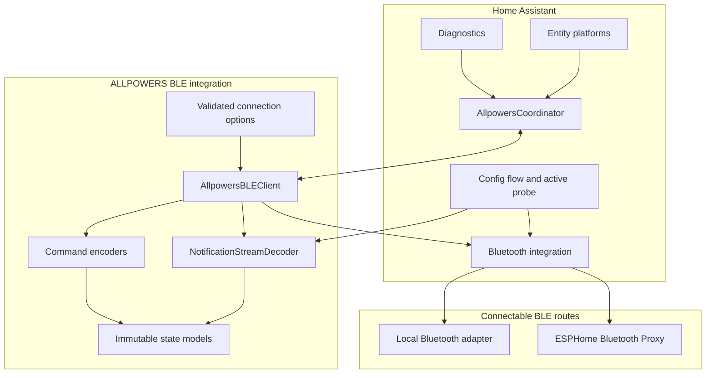
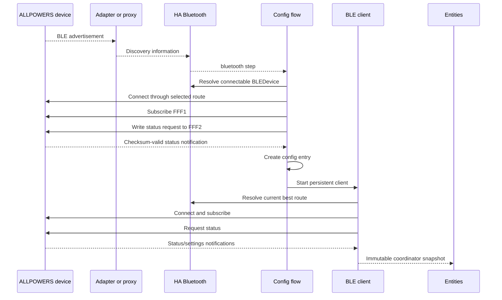
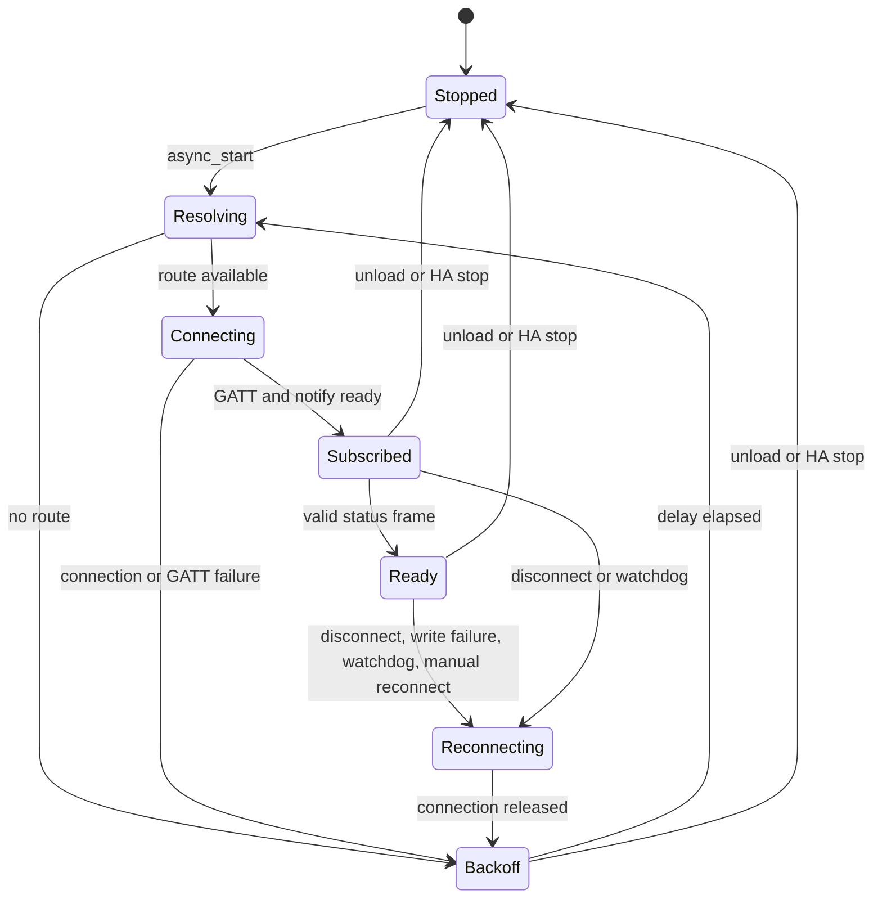

# Implementation architecture

This document is the concise, implementation-oriented architecture summary.

## Design goals

The integration is organized around five constraints:

1. use Home Assistant's Bluetooth routing instead of direct BlueZ access;
2. keep the vendor protocol reusable outside Home Assistant;
3. reject unsafe writes when state is incomplete or stale;
4. survive proxy changes, fragmented notifications, and transient disconnects;
5. expose immutable snapshots to entities with predictable availability.

## Component view

## Module responsibilities

| Module | Responsibility |
|---|---|
| `protocol/models.py` | Immutable decoded protocol values and enums. |
| `protocol/codec.py` | Frame validation, stream recovery, decoding, encoding, and safe settings mutation. |
| `client.py` | Active BLE session, route resolution, notifications, retries, watchdog, versioned command transactions, and statistics. |
| `models.py` | Integration-level snapshots and connection counters. |
| `options.py` | Home Assistant-independent option defaults and relationship validation. |
| `coordinator.py` | Push bridge from the BLE client to CoordinatorEntity consumers. |
| `config_flow.py` | Discovery, candidate filtering, active protocol probe, duplicate prevention, and options flow. |
| `entity.py` | Device metadata and freshness-based availability classes. |
| Platform modules | Home Assistant entities and service error translation. |
| `diagnostics.py` | Redacted entry/device diagnostics. |

## Setup sequence

The config flow does not trust an advertisement alone. It establishes a temporary
connection, verifies the expected service and characteristics, writes the known
status request, and waits for a valid decoded status response.

## Persistent connection state machine

Before each connection attempt the client asks Home Assistant for a fresh
connectable `BLEDevice`. This permits failover between local adapters and Bluetooth
proxies. Exponential backoff is capped by the configured maximum delay and adds
bounded jitter to reduce synchronized reconnect spikes across multiple devices.

## Data freshness

A live GATT socket is not sufficient proof that telemetry is current. The client
tracks monotonic timestamps for status, settings, and the last valid packet.

- Status entities and output controls require a connected session and status newer
  than `stale_timeout`.
- Settings entities and controls require a connected session and settings newer
  than `settings_stale_timeout`.
- The telemetry watchdog reconnects when no fresh status telemetry arrives
  within `watchdog_timeout`.
- The transport watchdog reconnects when no BLE packet arrives within
  `watchdog_timeout`.
- RSSI-only advertisement changes are debounced: updates publish immediately on the
  first value, when change magnitude is at least 3 dBm, or every 30 seconds as a
  maximum refresh interval.
- Freshness transitions are emitted even when no new BLE notification arrives.
- Cached data remains available to diagnostics, but cannot authorize writes after
  disconnect or expiry.
- Control platforms subscribe to coordinator updates and add newly authorized
  writable entities exactly once when revision-verified capabilities become
  available after setup.
- Capability downgrades do not remove registered entities; they transition to
  unavailable through normal availability checks.

## Safe command construction

### Combined outputs

AC, DC, and light share one command byte. A command is built from the latest safe
snapshot, changing only the requested field. Each write opens a pending output
transaction tied to the active session generation, the source status version,
and a confirmation deadline.

This preserves the documented output state mapping for the verified profile. It
does not claim safe preservation of undocumented output-command semantics.

### Settings

ECO, work mode, car charger, and ECO timeout also share a settings frame. The
integration starts with the most recent raw settings flags, applies only the known
mask, and sends the complete value. Unknown bits are preserved. Settings writes
use the same pending-transaction model as output writes.

Before any write frame is built, the client enforces revision-aware model
capabilities at the transport boundary under the operation lock:

- output writes require `write_output_controls`;
- settings updates require `write_settings_controls`;
- settings keepalive requires `write_settings_keepalive`.

Entity availability remains a UI guard only. Runtime profile downgrades are
therefore enforced even for direct internal client calls.

Transactions complete only when the matching notification arrives from the same
session generation. They are in-memory only and are cleared on disconnect, on new
GATT session, or when confirmation times out and a newer safe version is required.

Any new safety claim must include matching protocol evidence and regression tests
before it is documented as guaranteed behavior.

## Session generation boundaries

Every connection attempt increments a session generation identifier. Notification
and disconnection callbacks capture that identifier, and callbacks from older
generations are ignored. This prevents stale callbacks from mutating state after
route failover or reconnect.

## Concurrency and ownership

One `AllpowersBLEClient` owns all tasks and one write lock for a config entry:

- connection loop;
- maintenance/status/watchdog loop;
- optional delayed command refresh;
- one active GATT client;
- one notification decoder;
- one serialized command stream.

`async_stop` cancels owned tasks, waits for them, disconnects the client, and clears
the coordinator callback. Entry unload and Home Assistant shutdown use the same
idempotent shutdown path.

## Error boundaries

- Stream recovery byte discards and malformed-frame candidates are counted
  separately by the pure decoder path.
- Expected BLE and timeout exceptions enter reconnect/backoff behavior.
- Unexpected transport exceptions are recorded, logged, and also retried at the
  outer connection boundary.
- Entity services translate safe-state and disconnected errors into
  `HomeAssistantError`.
- Initial setup raises `ConfigEntryNotReady` when a route exists but valid telemetry
  is not yet available, allowing Home Assistant to retry.

## Persistence

Only config-entry data and options are persisted. Telemetry, protocol fragments,
pending transactions, counters, and connection state remain in memory. This avoids unnecessary
storage writes and prevents ephemeral state from being trusted after restart.

### Config-entry schema and migration baseline

The integration currently persists config entries at schema version `1.1`.

- `entry.data`
  - `address` (`str`, normalized uppercase Bluetooth MAC address)
  - `device_name` (`str`, device label captured at setup)
- `entry.options`
  - `status_interval` (`float`)
  - `stale_timeout` (`float`)
  - `watchdog_timeout` (`float`)
  - `reconnect_max_delay` (`float`)
  - `settings_stale_timeout` (`float`)
  - `settings_keepalive` (`bool`)
  - `settings_keepalive_interval` (`float`)
  - `enable_car_charger` (`bool`)

Migration runs through `async_migrate_entry` before setup. The current baseline
supports migration from `1.0` to `1.1` by normalizing persisted options and
filling any missing keys with safe defaults. Unsupported future versions are
rejected explicitly so setup fails cleanly instead of partially initializing.

Migration does not perform network I/O, does not mutate unique IDs, and is
idempotent once an entry reaches the latest schema.
