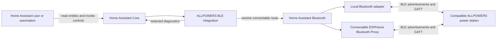
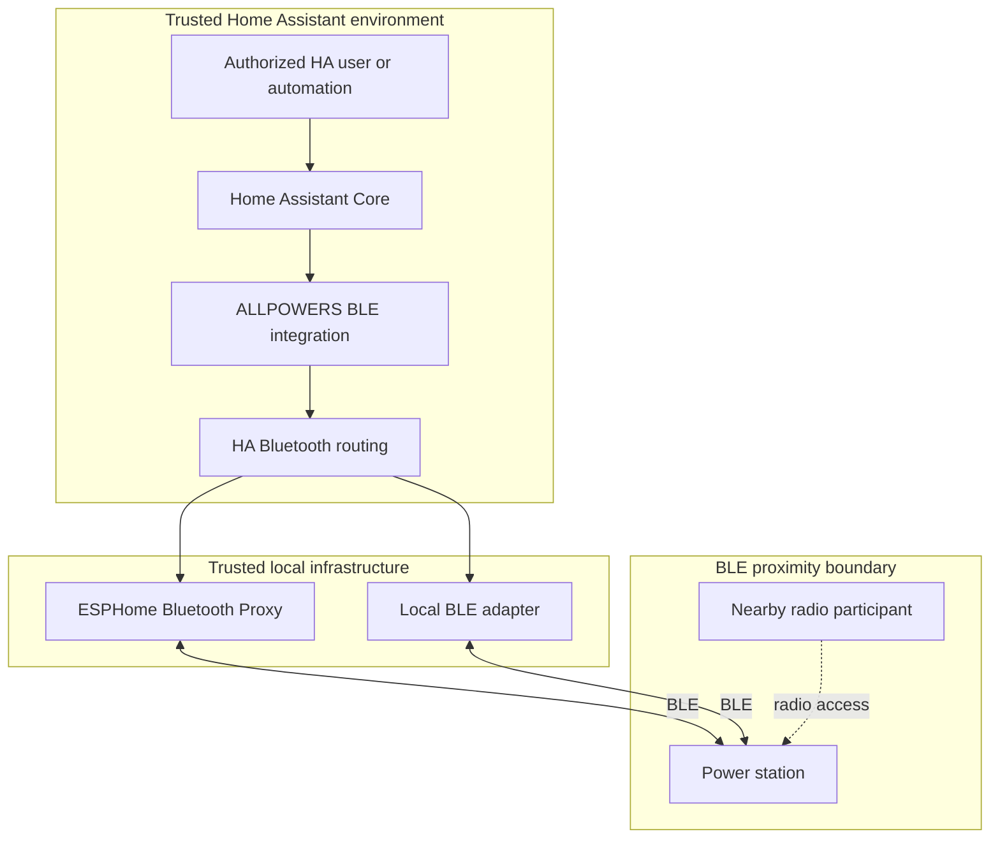
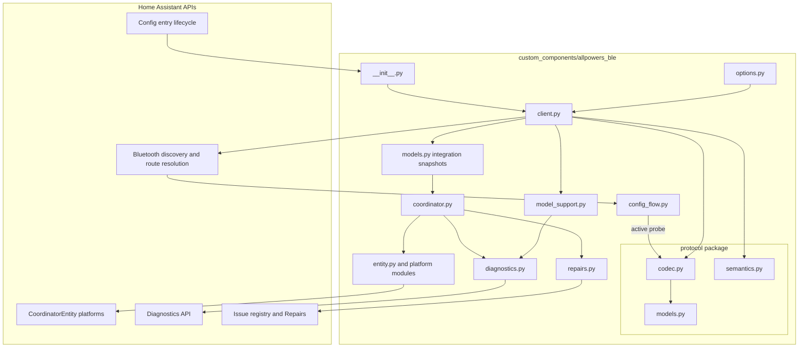
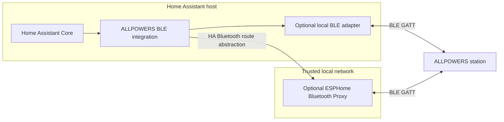
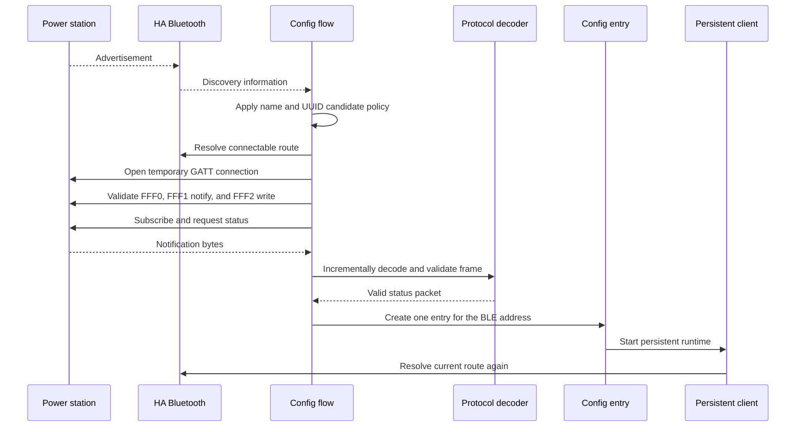
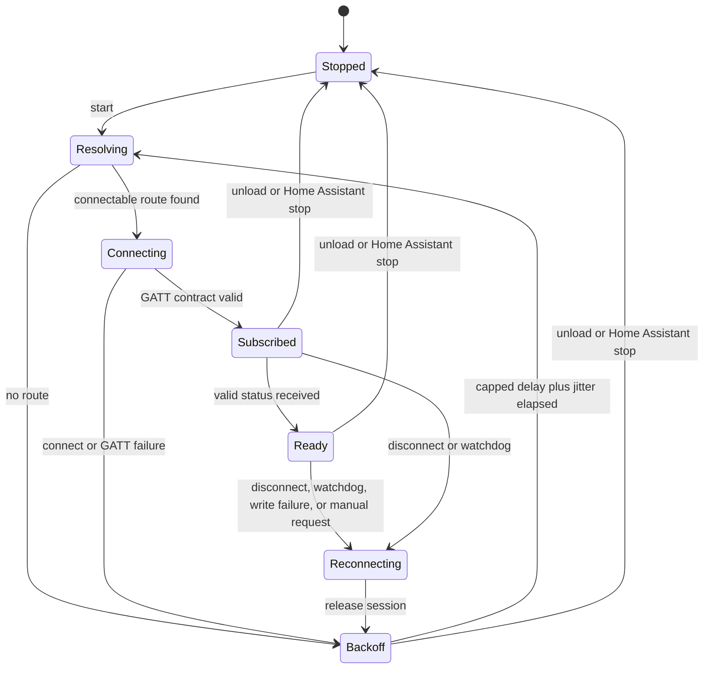
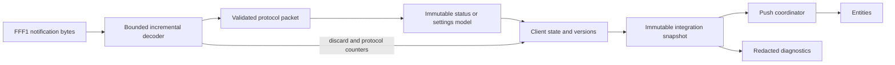
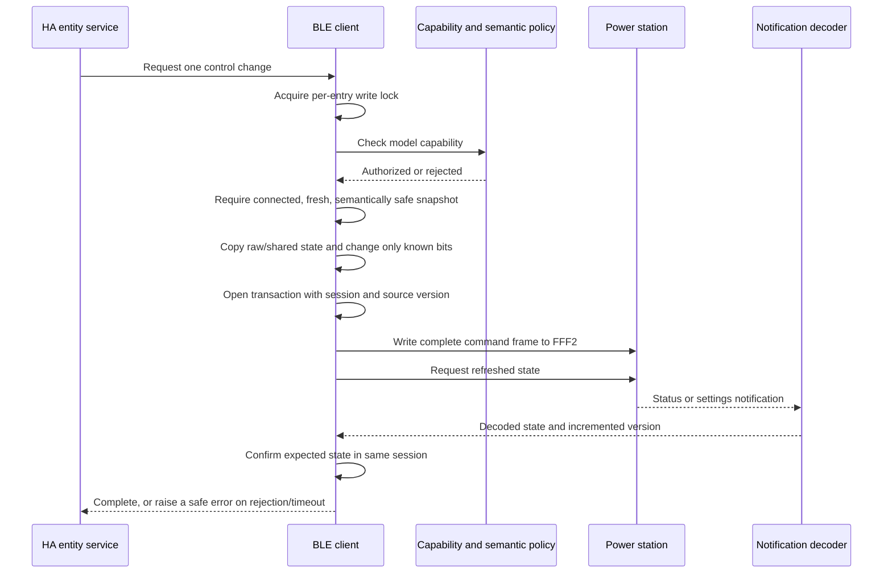
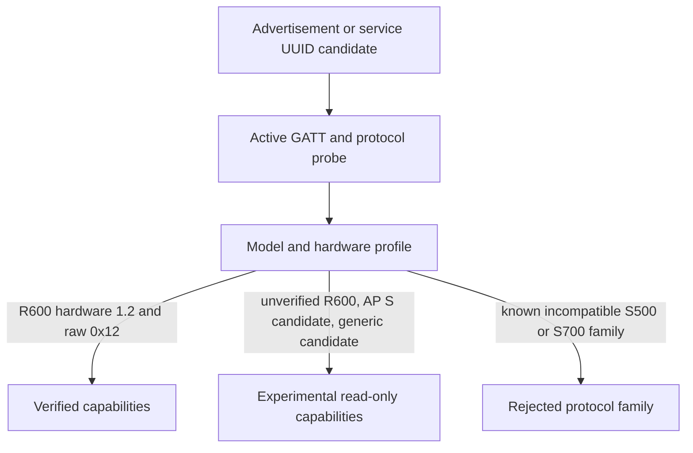
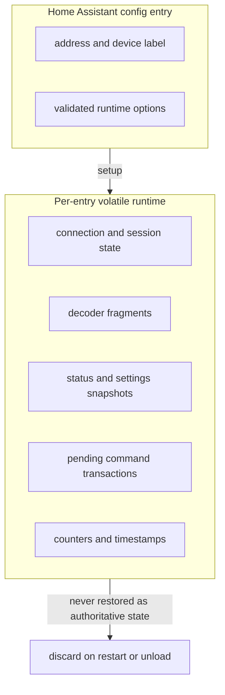

# System architecture

## 1. Purpose

ALLPOWERS BLE is a Home Assistant custom integration for selected ALLPOWERS power
stations. It discovers a station, validates that it speaks the expected BLE
protocol, maintains a local GATT session, converts protocol notifications into
Home Assistant entities, and exposes a deliberately constrained set of controls.

This document describes the as-is architecture observed on `devel` on 2026-07-28.
The architecture documentation target release is `0.3.1`.

## 2. Scope and non-goals

### In scope

- Home Assistant discovery, config entries, entities, diagnostics, and options.
- Home Assistant Repairs for persistent, actionable transport/configuration failures.
- Home Assistant Bluetooth routing through a local adapter or a connectable
  ESPHome Bluetooth Proxy.
- GATT session ownership, reconnection, watchdogs, and notification handling.
- Pure-Python protocol framing, incremental decoding, immutable protocol models,
  command construction, and semantic write validation.
- Model classification and per-profile capability authorization.

### Out of scope

- Vendor cloud APIs or credentials.
- Direct BlueZ ownership outside Home Assistant.
- Firmware updates, pairing management, or device authentication.
- A general-purpose standalone protocol package with independent releases.
- Safety-interlock guarantees for unattended critical loads.
- Write support for hardware revisions without device-specific evidence.

## 3. Architectural drivers

| Driver | Architectural response |
|---|---|
| BLE routes may move between adapters and proxies | Resolve a fresh connectable route before every connection attempt. |
| Notifications may be fragmented, concatenated, or noisy | Use a bounded incremental stream decoder with resynchronization. |
| A connected socket can still carry stale data | Track status, settings, and packet freshness independently. |
| Several controls share command bytes | Build commands from fresh state, preserve unrelated bits, serialize writes, and require confirmation. |
| Product names and UUIDs overlap across revisions | Require an active GATT and protocol probe before creating an entry. |
| The protocol is reverse engineered | Keep unknown data observable and deny writes when semantics are not proved. |
| Home Assistant can host multiple stations | Give each config entry one isolated client, task set, write lock, and session generation. |
| Diagnostics may expose household identifiers | Recursively redact BLE addresses and device/user names. |

## 4. System context

There is no vendor-cloud dependency. Home Assistant is both the user-facing
control plane and the owner of Bluetooth route selection.

## 5. Trust boundaries

- Home Assistant authorization controls who can invoke entity services.
- Adapters and ESPHome proxies are trusted transport infrastructure.
- BLE proximity is a risk boundary, not authentication.
- The device protocol is treated as untrusted input until framing and semantics
  are validated.
- Diagnostics cross from runtime state to a user-downloadable artifact and are
  sanitized before that boundary.

## 6. Component view

## 7. Module responsibilities

| Path | Responsibility |
|---|---|
| `custom_components/allpowers_ble/__init__.py` | Config-entry migration, setup, platform forwarding, live option listener, and shutdown. |
| `config_flow.py` | Discovery, candidate filtering, duplicate prevention, active probe, manual selection, and options UI. |
| `client.py` | Session ownership, route resolution, GATT validation, parser lifecycle, retries, watchdogs, safe command transactions, and counters. |
| `coordinator.py` | Push bridge from client snapshots to Home Assistant entities; initial readiness gate. |
| `entity.py` and platform modules | Entity metadata, freshness/capability availability, values, and service-error translation. |
| `model_support.py` | Device classification and immutable per-profile capability flags. |
| `options.py` | Home Assistant-independent defaults, types, range checks, and cross-field validation. |
| `models.py` | Immutable integration snapshot and connection-statistic models. |
| `repairs.py` | Entry-scoped persistent/debounced Repairs for actionable no-route, repeated watchdog, and invalid-migration states. |
| `protocol/codec.py` | Frame validation, incremental stream recovery, packet decoding, command encoding, and bit-preserving mutation. |
| `protocol/models.py` | Immutable protocol values and enums. |
| `protocol/semantics.py` | Profile-specific checks that decide whether decoded state can authorize a write. |
| `diagnostics.py` | Structured runtime diagnostics and recursive identifier sanitization. |

## 8. Deployment view

The integration is route-agnostic after asking Home Assistant for a connectable
`BLEDevice`. A passive-only proxy can contribute advertisements but cannot satisfy
the active GATT requirement.

## 9. Discovery and setup flow

An advertisement is only a candidate signal. Entry creation requires a real
connectable route, the expected GATT contract, and a checksum-valid status frame.

## 10. Runtime connection lifecycle

Before each new attempt, the client resolves the current best route through Home
Assistant. Every successful GATT setup creates a new session generation. Callback
closures carry that generation, so late notifications or disconnect callbacks
from an earlier connection cannot mutate the current session.

## 11. Notification and publication flow

The coordinator has no periodic Home Assistant refresh interval. The client
publishes immutable snapshots when state or freshness changes. The manifest still
uses `local_polling` because the client periodically sends an explicit local status
request; transport publication remains push-oriented.

### Freshness domains

- Status freshness controls telemetry entities and output commands.
- Settings freshness controls settings entities and settings commands.
- Last-valid-packet freshness detects a connected but silent transport.
- Cached values remain diagnostic evidence but cannot authorize commands after
  disconnect or expiry.

## 12. Safe write transaction

Output and settings commands are not optimistic UI shadows. A later write cannot
reuse a source state while a previous command remains unconfirmed. Disconnect,
new-session setup, or confirmation timeout invalidates the pending transaction.

## 13. Capability and compatibility model

Capability flags are data, not scattered name checks. The verified R600 hardware
signature can read telemetry and use output/settings writes. Unverified candidates
remain telemetry-only. Known incompatible families are rejected explicitly before
broad name or service-UUID matches.

## 14. Concurrency and ownership

One `AllpowersBLEClient` is created per config entry and owns:

- one active GATT client;
- one connection/retry loop;
- one maintenance, status-request, and watchdog loop;
- one incremental decoder;
- one session generation counter;
- one write lock and serialized command stream;
- zero or one pending output transaction;
- zero or one pending settings transaction;
- optional delayed refresh work;
- the callback used to publish coordinator snapshots.

Shutdown is idempotent. Owned tasks are canceled and awaited before the connection
is released and the coordinator callback is cleared.

## 15. Persistence and data lifecycle

The current config-entry schema is `1.1`. Migration from `1.0` normalizes the
address and options, fills safe defaults, and rejects unsupported future versions.
Telemetry, parser fragments, transactions, counters, and freshness timestamps are
not persisted, so a restart cannot accidentally trust old device state.

## 16. Options

`ConnectionOptions` is immutable and independent of Home Assistant internals.
Validation covers both individual ranges and safety relationships:

- telemetry stale timeout must exceed the status-request interval;
- watchdog timeout must exceed the telemetry stale timeout;
- when settings keepalive is enabled, settings stale timeout must exceed the
  keepalive interval;
- booleans accept only real booleans or the integer values zero and one.

Valid option changes are applied to the running client without forcing a BLE
reload. Existing entities recalculate availability from the new thresholds.

## 17. Error and recovery boundaries

| Failure | Boundary and response |
|---|---|
| No connectable route | Stay out of GATT setup and retry with capped exponential backoff and jitter. |
| Connect or GATT validation failure | Release the partial session and retry through a newly resolved route. |
| Malformed or noisy notification stream | Discard bounded bytes, count parser/protocol errors, and continue resynchronization. |
| Connected but stale telemetry | Mark affected entities unavailable; watchdog forces reconnection. |
| Connected but silent transport | Transport watchdog forces reconnection. |
| Unsafe, stale, unsupported, or unconfirmed write state | Reject the service call rather than guess a command. |
| Late callback from old session | Ignore it by generation comparison. |
| Initial route exists but no valid status arrives | Raise `ConfigEntryNotReady` so Home Assistant can retry setup. |
| Unload or Home Assistant stop | Cancel and await owned tasks, disconnect, and clear runtime callbacks. |

## 18. Observability and privacy

Diagnostics include connection counters, freshness, active options, model
classification, current cached protocol state, parser and write errors, and safety
flags. Before export, the integration removes or replaces:

- BLE addresses in structured fields and nested strings;
- device-provided names;
- config-entry titles and stored device labels;
- sensitive details embedded in the last error while retaining an error category.

Repairs complement diagnostics with low-noise, persistent, user-actionable
issues for conditions that are both deterministic and recoverable. Transient BLE
events are intentionally excluded.

The test strategy covers protocol vectors, stream recovery, option relationships,
client transactions, route loss, session races, watchdogs, config flow, entities,
diagnostics, setup, and real Home Assistant imports. The configured branch
coverage threshold is 98 percent. Automated tests do not replace hardware-in-the-
loop evidence for a new model or writable command.

## 19. Architecture fitness functions

| Decision boundary | Current evidence |
|---|---|
| Protocol code remains independent from Home Assistant | Protocol modules and protocol-focused tests import pure Python models/codecs rather than HA runtime APIs. |
| Discovery alone cannot create an entry | Config-flow tests cover active-probe outcomes and unsupported candidates. |
| Writes require safe state and confirmation | Client tests cover freshness, serialization, transaction versions, disconnect invalidation, and delayed/contradictory confirmations. |
| Session callbacks cannot cross reconnect boundaries | Deterministic runtime tests inject old-session callbacks and reconnect interleavings. |
| Unknown bits are preserved | Protocol vectors and command tests exercise raw flag preservation. |
| Sensitive identifiers do not leave diagnostics | Diagnostics tests cover recursive redaction and serialization. |
| Options cannot form unsafe timing relationships | Unit tests validate ranges, defaults, booleans, and cross-field constraints. |
| Repository quality remains measurable | CI runs formatting, linting, typing, tests, coverage, HACS, Hassfest, CodeQL, and dependency checks. |

## 20. Known limits and review triggers

The following are not resolved by documentation and should trigger an ADR review:

1. A second independent consumer needs the protocol package, or protocol families
   require independent release cadence.
2. Home Assistant changes Bluetooth route, coordinator, config-entry, or IoT-class
   guidance in a way that changes the current integration contract.
3. A device revision is proposed for writable capabilities.
4. The vendor protocol introduces pairing, authentication, encryption, firmware
   updates, or materially different GATT services.
5. Durable history or state restoration is proposed for telemetry, counters, or
   command transactions.
6. Diagnostics add new free-form fields that may contain identifiers.
7. Multiple concurrent commands or multiple GATT connections per station are
   proposed.

## 21. Decision map

The architecture contract is decomposed into the records in
[the architecture decision log](decisions/README.md). The original
`docs/design-decisions.md` remains useful source evidence, while the ADRs add
status, alternatives, consequences, fitness functions, and supersession rules.
